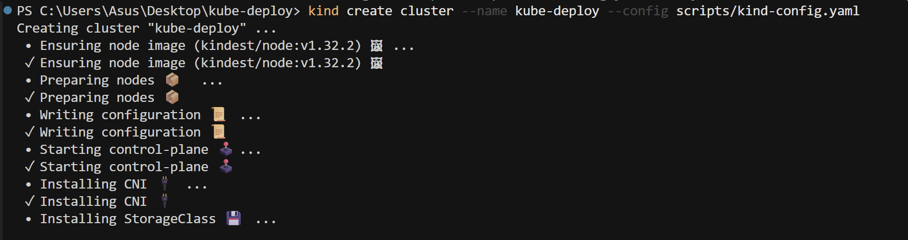
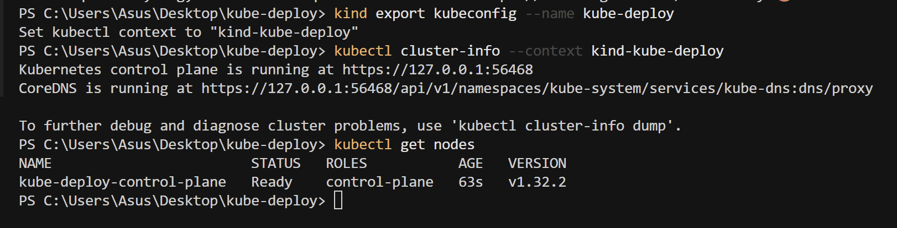
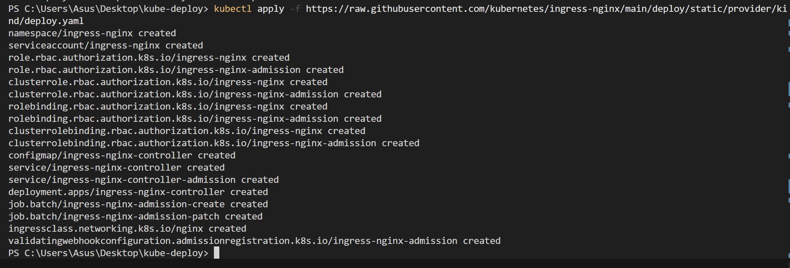
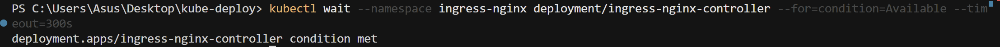
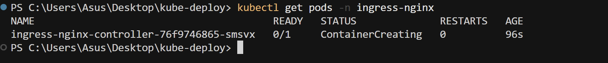
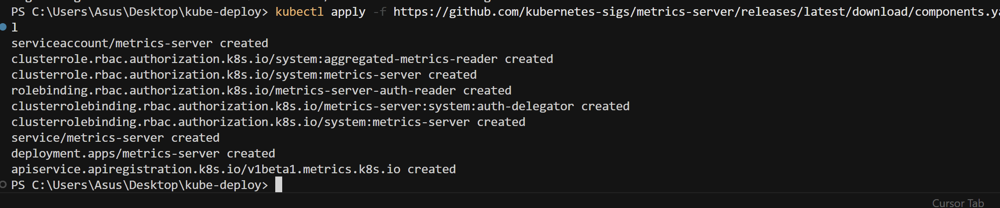
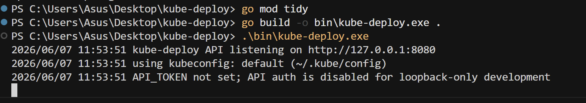
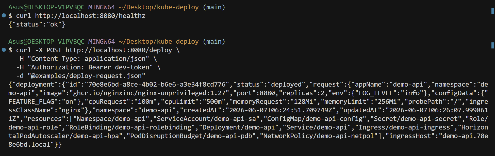
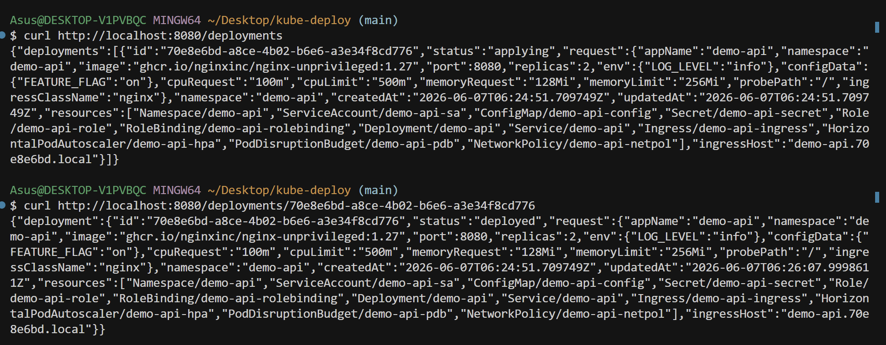

# kube-deploy — Screenshots

Visual walkthrough of the local cluster setup, API startup, and REST responses.

---

## 1. Kind cluster creation

Creating the local kind cluster with `scripts/kind-config.yaml`. The node image, control plane, and CNI install successfully.



```powershell
kind create cluster --name kube-deploy --config scripts/kind-config.yaml
```

---

## 2. Kind cluster ready

After exporting kubeconfig, the control plane is running and the node reports **Ready**.



```powershell
kind export kubeconfig --name kube-deploy
kubectl cluster-info --context kind-kube-deploy
kubectl get nodes
```

---

## 3. NGINX Ingress Controller installed

Ingress resources are applied from the official kind manifest. Namespace, RBAC, deployment, and webhook resources are created.



```powershell
kubectl apply -f https://raw.githubusercontent.com/kubernetes/ingress-nginx/main/deploy/static/provider/kind/deploy.yaml
```

---

## 4. Ingress controller available

The ingress controller deployment reaches the **Available** condition within the timeout.



```powershell
kubectl wait --namespace ingress-nginx `
  deployment/ingress-nginx-controller `
  --for=condition=Available --timeout=300s
```

---

## 5. Ingress controller pod starting

The controller pod enters **ContainerCreating** before becoming ready to route traffic.



```powershell
kubectl get pods -n ingress-nginx
```

---

## 6. Metrics Server installed

Metrics Server components are applied so HPA and resource metrics work in the cluster.



```powershell
kubectl apply -f https://github.com/kubernetes-sigs/metrics-server/releases/latest/download/components.yaml
```

---

## 7. API built and running

The kube-deploy API starts on `http://127.0.0.1:8080`, uses the default kubeconfig, and runs with auth disabled for local development.



```powershell
go mod tidy
go build -o bin\kube-deploy.exe .
.\bin\kube-deploy.exe
```

---

## 8. Health check and deploy request

`GET /healthz` returns `{"status":"ok"}`.

`POST /deploy` with `examples/deploy-request.json` provisions namespace, deployment, service, ingress, HPA, and related resources.



```bash
curl http://localhost:8080/healthz

curl -X POST http://localhost:8080/deploy \
  -H "Content-Type: application/json" \
  -H "Authorization: Bearer dev-token" \
  -d "@examples/deploy-request.json"
```

---

## 9. List and get deployment status

`GET /deployments` lists all deployments.

`GET /deployments/{id}` shows status progressing from **applying** to **deployed**.



```bash
curl http://localhost:8080/deployments

curl http://localhost:8080/deployments/70e8e6bd-a8ce-4b02-b6e6-a3e34f8cd776
```
